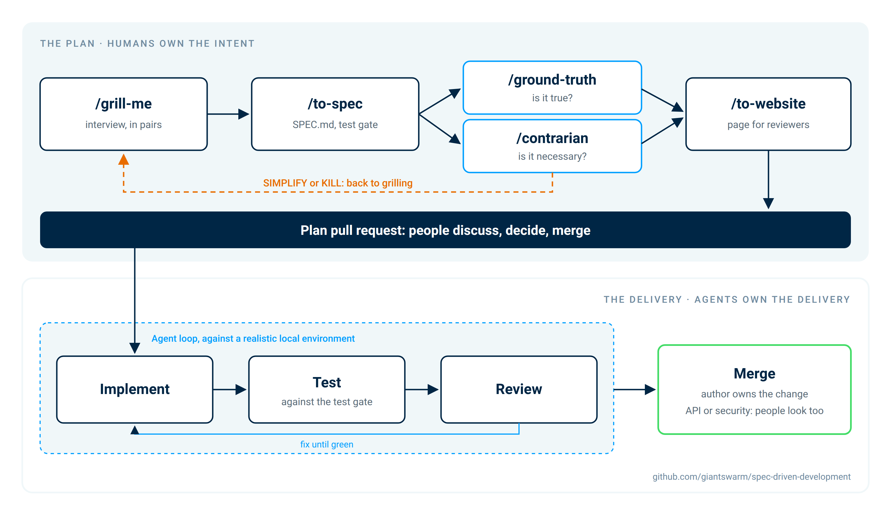

# spec-driven-development

A template repository for **spec-driven development: reviewing plans instead of pull requests.**

Humans own the intent. Agents own the delivery.



## Why

Coding agents write more code than a team can review. And if you hand a model the
decisions, you get an average product. So the review moves to the plan: people argue
about it, decide and merge it, then agents implement against the agreed spec.

This repo is where those plans live. Fork it and your team
has the whole workflow. No install step: the skills are committed here.

## What a plan is

One directory per plan, reviewed as one pull request:

- **`SPEC.md`**: the source of truth the implementing agent works from
- **`index.html`**: the page reviewers read, rendered from the spec
- dated artifacts: grilling logs, research, ground-truth reports, contrarian verdicts

See [`example-plan/`](./example-plan) for a complete one.

## The workflow

```
/plan  →  /grill-me  →  /to-spec  →  /ground-truth  +  /contrarian  →  /to-website  →  (/to-issues)
```

| Step | What it does |
|---|---|
| `/plan` | Runs the whole pipeline from a seed (an issue, an idea, a file) |
| `/grill-me` | Interviews you about every decision, logs each answer, keeps the glossary sharp |
| `/to-spec` | Turns the interview into `SPEC.md`, including the test gate |
| `/ground-truth` | Checks every claim about existing code and facts against the real source |
| `/contrarian` | Tries to kill the plan: BUILD, SIMPLIFY or KILL. Anything but BUILD goes back to grilling |
| `/to-website` | Renders `index.html` for reviewers |
| `/to-issues` | Optional: splits the plan into GitHub issues |

A typical plan takes a few hours. We recommend grilling in pairs, so decisions get argued
rather than taken alone.

**When to plan:** if a change contains a decision someone could disagree with, it gets a
plan. Bumps and obvious fixes don't.

**A plan is a baseline, not a contract.** Update, replace or abandon it when you learn more.

## Getting started

See [SETUP.md](./SETUP.md), about ten minutes. Then read the example plan and run one real
change through `/plan`. Before handing specs to agents, make sure they have tests they can
run and a local environment to try things in.

## The skills

`plan`, `ground-truth`, `contrarian` and `to-website` are original to this repo.
`grill-me`, `to-spec`, `to-issues` and `research` are customized copies from
[Matt Pocock's skills](https://github.com/mattpocock/skills). See
[`.agents/skills/UPSTREAM.md`](./.agents/skills/UPSTREAM.md) before pulling upstream
changes. Agent conventions live in `AGENTS.md`.

Built by Giant Swarm's Agent Platform Team. MIT licensed, see [LICENSE](./LICENSE) and
[THIRD-PARTY-NOTICES.md](./THIRD-PARTY-NOTICES.md).
